# BallotDefinition UML Model

- Table of Contents
  - Enumerations
    - *The **[BallotDefinitionVersion](#_19_0_4_2a60152_1659798553607_654035_5179)** Enumeration*
    - *The **[BallotMeasureType](#_17_0_2_4_f71035d_1426549604222_56408_2487)** Enumeration*
    - *The **[BallotSideType](#_19_0_4_43701b0_1638888251218_423470_6185)** Enumeration*
    - *The **[CandidatePreElectionStatus](#_17_0_2_4_f71035d_1427223542780_950918_2213)** Enumeration*
    - *The **[DayType](#_18_0_2_6340208_1425647845906_917814_4818)** Enumeration*
    - *The **[ElectionType](#_17_0_2_4_78e0236_1389734457182_720347_3938)** Enumeration*
    - *The **[GeoSpatialFormat](#_17_0_2_4_f71035d_1425325534467_889921_2544)** Enumeration*
    - *The **[IdentifierType](#_17_0_2_4_f71035d_1425061188508_163854_2613)** Enumeration*
    - *The **[MeasurementUnitType](#_19_0_4_43701b0_1644432449846_831106_5074)** Enumeration*
    - *The **[OfficeTermType](#_17_0_2_4_f71035d_1425314816880_411605_2504)** Enumeration*
    - *The **[OrientationType](#_19_0_4_43701b0_1654872700628_375746_5104)** Enumeration*
    - *The **[ReadMethodType](#_19_0_4_43701b0_1656439060260_881241_16237)** Enumeration*
    - *The **[ReportingUnitType](#_17_0_2_4_f71035d_1431607637366_785815_2242)** Enumeration*
    - *The **[ShapeType](#_19_0_4_43701b0_1657558418384_602517_5820)** Enumeration*
    - *The **[StraightPartyRuleset](#_19_0_4_43701b0_1657644674655_50560_5899)** Enumeration*
    - *The **[VoteVariation](#_17_0_2_4_78e0236_1389798224990_11192_4272)** Enumeration*
  - Classes
    - *The **[ActivationContest](#_19_0_4_43701b0_1657644824107_634969_5936)** Class*
    - *The **[ActivationSelection](#_19_0_4_43701b0_1657540726121_302449_5703)** Class*
    - *The **[AnnotatedString](#_18_0_2_6340208_1497553224568_429892_4565)** Class*
    - *The **[AnnotatedUri](#_18_0_2_6340208_1498658436378_308208_4565)** Class*
    - *The **[BallotDefinition](#_17_0_2_4_78e0236_1389366195564_913164_2300)** Class*
    - *The **[BallotFormat](#_19_0_4_43701b0_1638813504993_325485_4993)** Class*
    - *The **[BallotMeasureContest](#_17_0_2_4_78e0236_1389366932057_929676_2783)** Class*
    - *The **[BallotMeasureSelection](#_17_0_2_4_78e0236_1389372163799_981952_2926)** Class*
    - *The **[BallotStyle](#_17_0_2_4_78e0236_1389366224561_797289_2360)** Class*
    - *The **[BoundedObject](#_19_0_4_43701b0_1638813504988_273981_4988)** Class*
    - *The **[Candidate](#_17_0_2_4_78e0236_1389366272694_544359_2440)** Class*
    - *The **[CandidateContest](#_17_0_2_4_78e0236_1389366970084_183781_2806)** Class*
    - *The **[CandidateSelection](#_17_0_2_4_d420315_1392145640524_831493_2562)** Class*
    - *The **[Coalition](#_18_0_2_6340208_1425647247631_162984_4712)** Class*
    - *The **[ContactInformation](#_17_0_5_1_43401a7_1400624327407_326048_3637)** Class*
    - *The **[Contest](#_17_0_2_4_78e0236_1389366251994_876831_2400)** Class*
    - *The **[ContestSelection](#_17_0_2_4_78e0236_1389372124445_11077_2906)** Class*
    - *The **[ControllingContest](#_19_0_4_43701b0_1657539979421_509884_5407)** Class*
    - *The **[DateTimeWithZone](#_18_0_2_6340208_1519999692422_172889_4576)** Class*
    - *The **[Election](#_17_0_2_4_f71035d_1426101822599_430942_2209)** Class*
    - *The **[ElectionAdministration](#_18_0_2_6340208_1441311877439_710008_4433)** Class*
    - *The **[ExternalIdentifier](#_17_0_2_4_f71035d_1430405712653_451634_2410)** Class*
    - *The **[FiducialMark](#_19_0_4_43701b0_1658343993325_108021_5129)** Class*
    - *The **[FractionalNumber](#_19_0_4_43701b0_1654793467815_816834_5117)** Class*
    - *The **[Geometry](#_19_0_4_43701b0_1638813504993_202084_4994)** Class*
    - *The **[GpUnit](#_17_0_2_4_78e0236_1389366233346_42391_2380)** Class*
    - *The **[Header](#_18_5_3_43701b0_1527684342703_968085_6144)** Class*
    - *The **[Hours](#_18_0_2_6340208_1427122205989_885563_4602)** Class*
    - *The **[HtmlColorString](#_17_0_2_4_f71035d_1428586849773_722256_2252)** Class*
    - *The **[InternationalizedText](#_17_0_2_4_f71035d_1428953680097_700602_2220)** Class*
    - *The **[LanguageString](#_17_0_2_4_f71035d_1428953680095_709464_2219)** Class*
    - *The **[LatLng](#_17_0_2_4_f71035d_1443104838926_393729_2222)** Class*
    - *The **[mCDFArea](#_19_0_4_43701b0_1638813504986_694762_4987)** Class*
    - *The **[Office](#_17_0_5_1_43401a7_1400623830572_164081_3518)** Class*
    - *The **[OfficeGroup](#_17_0_2_4_f71035d_1433183615993_866714_2239)** Class*
    - *The **[OptionPosition](#_19_0_4_43701b0_1638813504990_545136_4990)** Class*
    - *The **[OrderedContent](#_18_5_3_43701b0_1527684342715_643544_6146)** Class*
    - *The **[OrderedContest](#_17_0_3_43401a7_1394476416139_808596_3142)** Class*
    - *The **[OrderedHeader](#_18_5_3_43701b0_1527684342714_129907_6145)** Class*
    - *The **[Party](#_17_0_2_4_78e0236_1389366278128_412819_2460)** Class*
    - *The **[PartyContest](#_19_0_4_2a60152_1659614399459_632025_5041)** Class*
    - *The **[PartyPreferenceContest](#_19_0_4_43701b0_1657644855685_740858_5970)** Class*
    - *The **[PartyRegistration](#_17_0_2_4_78e0236_1394566839296_58362_2826)** Class*
    - *The **[PartySelection](#_17_0_2_4_f71035d_1426519980658_594892_2511)** Class*
    - *The **[Person](#_17_0_5_1_43401a7_1400623980732_100904_3567)** Class*
    - *The **[PhysicalContest](#_19_0_4_43701b0_1654799451085_749033_5240)** Class*
    - *The **[PhysicalContestOption](#_19_0_4_43701b0_1638814789673_90932_5706)** Class*
    - *The **[ReportingUnit](#_17_0_2_4_f71035d_1400606476166_735297_2593)** Class*
    - *The **[RetentionContest](#_18_0_2_6340208_1425646217522_163181_4554)** Class*
    - *The **[Schedule](#_18_0_2_6340208_1427122121448_198970_4547)** Class*
    - *The **[ShortString](#_18_0_2_6340208_1499878618645_537953_4560)** Class*
    - *The **[SpatialDimension](#_17_0_2_4_f71035d_1407165065674_39189_2188)** Class*
    - *The **[SpatialExtent](#_17_0_2_4_f71035d_1409080246279_778720_2209)** Class*
    - *The **[StraightPartyContest](#_17_0_2_4_d420315_1393514218965_55008_3144)** Class*
    - *The **[Term](#_17_0_2_4_f71035d_1428489072598_282236_2217)** Class*
    - *The **[TimeWithZone](#_18_0_2_6340208_1427385616970_86952_4407)** Class*
    - *The **[WriteInPosition](#_19_0_4_43701b0_1638813504998_266381_4995)** Class*

## Enumerations

### *The **BallotDefinitionVersion** Enumeration*

Name | Value
---- | -----
`1.0.0`|For version 1.0.0 of this specification.

### *The **BallotMeasureType** Enumeration*

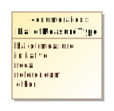

Enumeration for types of ballot measures in the [BallotMeasureContest](#_17_0_2_4_78e0236_1389366932057_929676_2783) element.

Name | Value
---- | -----
`ballot-measure`|For a standard “yes” or “no” question on the ballot.
`initiative`|For an initiative.
`recall`|For a recall.
`referendum`|For a referendum.
`other`|Used when the type of ballot measure is not included in this enumeration.

### *The **BallotSideType** Enumeration*

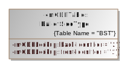

The side of a ballot sheet.

Name | Value
---- | -----
`back`|The back of the ballot sheet.
`front`|The front of the ballot sheet

### *The **CandidatePreElectionStatus** Enumeration*

Enumeration for various pre-election statuses applicable to a candidate in the [Candidate](#_17_0_2_4_78e0236_1389366272694_544359_2440) class.

Name | Value
---- | -----
`filed`|For candidates who have filed with the election authority but not necessarily qualified.
`qualified`|For candidates who are qualified by the election authority to be on the ballot for a contest.
`withdrawn`|For candidates who have withdrawn from the contest.

### *The **DayType** Enumeration*

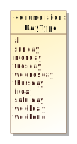

Enumeration for the day(s) in a schedule in the [Schedule](#_18_0_2_6340208_1427122121448_198970_4547) element.

Name | Value
---- | -----
`all`|Used for all days of the week.
`sunday`|Used if day of week is Sunday.
`monday`|Used if day of week is Monday.
`tuesday`|Used if day of week is Tuesday.
`wednesday`|Used if day of week is Wednesday.
`thursday`|Used if day of week is Thursday.
`friday`|Used if day of week is Friday.
`saturday`|Used if day of week is Saturday.
`weekday`|Used for any day of the week.
`weekend`|Used for both Saturday and Sunday.

### *The **ElectionType** Enumeration*

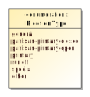

Enumeration for the type of election in the [ElectionReport](#_17_0_2_4_78e0236_1389366195564_913164_2300) class.

Name | Value
---- | -----
`general`|Election in which all eligible voters, regardless of party affiliation, are permitted to select candidates to fill public office and/or vote on ballot measures.
`partisan-primary-closed`|Primary election in which the voter receives a ballot containing only those party-specific contests pertaining to the political party with which the voter is affiliated, along with non-party-specific contests presented at the same election. Unaffiliated voters may be permitted to vote only on non-party-specific contests.
`partisan-primary-open`|Primary election in which the voter may choose a political party at the time of voting and vote in party-specific contests associated with that party, along with non-party-specific contests presented at the same election. Some states require voters to publicly declare their choice of party at the polling place, after which the election worker provides or activates the appropriate ballot. Other states allow the voters to make their choice of party within the privacy of the voting booth.
`primary`|Election held to determine which candidates qualify to appear as contest options in subsequent elections.
`runoff`|Election to select a winner following a primary or a general election, in which no candidate in the contest received the required minimum percentage of the votes cast. The two candidates receiving the most votes for the contest in question proceed to a runoff election.
`special`|Primary or general election that is not regularly scheduled. A special election may be combined with a scheduled election.
`other`|Used when the election type is not listed in this enumeration.

### *The **GeoSpatialFormat** Enumeration*

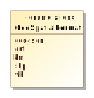

Enumeration for geospatial vector data formats used in Geographic Information System (GIS) software, used in the [SpatialExtent](#_17_0_2_4_f71035d_1409080246279_778720_2209) class.

Name | Value
---- | -----
`geo-json`|For GeoJSON open standard format.
`gml`|For Geography Markup Language format.
`kml`|For Keyhole Markup Language format.
`shp`|For the shape file format associated with Esri.
`wkt`|For Well-known Text format.

### *The **IdentifierType** Enumeration*

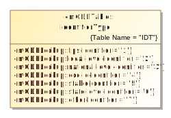

Enumeration for election data-related codes in the [ExternalIdentifier](#_17_0_2_4_f71035d_1430405712653_451634_2410) class .

Name | Value
---- | -----
`fips`|For FIPS codes.
`local-level`|For a code that is specific to a county or other similar locality.
`national-level`|For a code that is used at the national level other than “fips” or “ocd-id”.
`ocd-id`|For Open Civic Data identifiers.
`stable`|
`state-level`|For a code that is specific to a state.
`other`|Used when the type of code is not included in this enumeration.

### *The **MeasurementUnitType** Enumeration*

The measurement unit for describing the location of content on a ballot.

Name | Value
---- | -----
`in`|inches
`mm`|millimeters
`pc`|picas
`pt`|points (1/72 inch)

### *The **OfficeTermType** Enumeration*

Enumeration for the office term type in the [Office](#_17_0_5_1_43401a7_1400623830572_164081_3518) class.

Name | Value
---- | -----
`full-term`|When the officeholder’s term began at the beginning of the full term of the office, e.g., 6 years for U.S. Senate.
`unexpired-term`|When the officeholder’s term began at some date after the beginning of the full term of the office, generally because the previous officeholder vacated the office before the fullterm expired.

### *The **OrientationType** Enumeration*

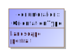

The orientation of a ballot sheet.

Name | Value
---- | -----
`landscape`|Orient the sheet so that the ballot content print across the long edge of the paper.
`portrait`|Orient the sheet so that the ballot content print across the short edge of the paper.

### *The **ReadMethodType** Enumeration*

Name | Value
---- | -----
`encoded-text`|For a read method that uses text encoded using a symbology.
`omr`|For a read method that uses optical mark recognition.

### *The **ReportingUnitType** Enumeration*

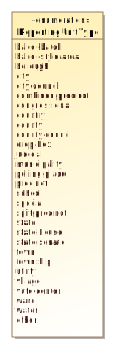

Enumeration for the type of geopolitical unit in the [ReportingUnit](#_17_0_2_4_f71035d_1400606476166_735297_2593) class.

Name | Value
---- | -----
`ballot-batch`|Used for reporting batches of ballots that may cross precinct boundaries.
`ballot-style-area`|Used for ballot style areas generally composed of precincts.
`borough`|Used in CT, NJ, PA, other states, and New York City for boroughs. For AK and LA, see county.
`city`|Used for a city that reports results and/or for the district that encompasses it.
`city-council`|Used for city council districts.
`combined-precinct`|Used for one or more precincts that have been combined for the purposes of reporting. Used for “Ward” if “Ward” is used interchangeably with “CombinedPrecinct”.
`congressional`|Used for U.S. Congressional districts.
`country`|Used for a reporting unit of type country.
`county`|Used for a county and/or for the district that encompasses it. In AK, used for counties that are called boroughs. In LA, used for parishes.
`county-council`|Used for county council districts.
`drop-box`|Used for a dropbox for absentee ballots.
`judicial`|Used for judicial districts.
`municipality`|Used as applicable for various units such as towns, townships, villages that report votes and/or for the district that encompasses it.
`polling-place`|Used for a polling place.
`precinct`|Used also for “Ward” or “District” when these terms are used interchangeably with “Precinct”.
`school`|Used for a school district.
`special`|Used for a special district.
`split-precinct`|Used for splits of precincts.
`state`|Used for a state and/or for the district that encompasses it.
`state-house`|Used for a state house or assembly district.
`state-senate`|Used for a state senate district.
`town`|Used in some New England states as a type of municipality that reports votes and/or for the district that encompasses it.
`township`|Used in some mid-western states as a type of municipality that reports votes and/or for the district that encompasses it.
`utility`|Used for a utility district.
`village`|Used as a type of municipality that reports votes and/or for the district that encompasses it.
`vote-center`|Used for a vote center.
`ward`|Used for combinations or groupings of precincts or other units.
`water`|Used for a water district.
`other`|Used for other types of reporting units not included in this enumeration.

### *The **ShapeType** Enumeration*

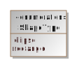

Name | Value
---- | -----
`ellipse`|For an ellipse shape
`rectangle`|For a rectangle shape

### *The **StraightPartyRuleset** Enumeration*

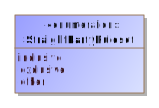

Specifies how to consider indications made in the controlled contests of a straight party controlling contest.These specify the consequences direct selections made by the voter in controlled contests.

Name | Value
---- | -----
`inclusive`|For a ruleset allowing any additional candidates selected by the straight-party to be included with directly selected candidates if the total number of candidates does not exceed the number of selections allowed. 
`exclusive`|For a ruleset that excludes any straight-party selections if there is a directly selected candidate in a contest. 
`other`|Used when the straight party rule type is not included in this enumeration.

### *The **VoteVariation** Enumeration*

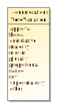

Enumeration for contest decision algorithm or rules in the [Contest](#_17_0_2_4_78e0236_1389366251994_876831_2400) element.

Name | Value
---- | -----
`approval`|When voter can select as many candidates as desired in a contest up to a maximum number.
`borda`|For the Borda count voting.
`cumulative`|When voter can allocate more than one vote to a given candidate.
`majority`|For majority voting.
`n-of-m`|Includes vote for 1, i.e., 1-of-m.
`plurality`|For plurality voting.
`proportional`|For proportional voting.
`range`|For range voting.
`rcv`|For ranked choice voting.
`super-majority`|For super majority voting.
`other`|Used when the vote variation type is not included in this enumeration.

## Classes

### *The **AnnotatedString** Class*

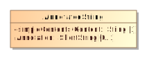

Used as a type for character strings; it adds a 32-character annotation to a character string.

Property  | Multiplicity | Type | Property Description
--------- | ------------ | ---- | ---------------------
`Annotation`|0..1|`ShortString`|An annotation of up to 32 characters associated with a character string.
`Content`|1|`String`|The string to be annotated.

### *The **AnnotatedUri** Class*

Used as a type for character strings that represent Uniform Resource Identifiers (URI); it adds a 32-character annotation to a character string.

Property  | Multiplicity | Type | Property Description
--------- | ------------ | ---- | ---------------------
`Annotation`|0..1|`ShortString`|An annotation of up to 32 characters associated with a character string.
`Content`|1|`anyURI`|The URI to be annotated.

### *The **BallotDefinition** Class*

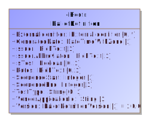

For defining items pertaining to the status and format of the definition and when it was generated.

BallotDefinition references the major elements that are not necessarily specific to an election and that therefore can exist in a logical ballot definition: [GpUnit](#_17_0_2_4_78e0236_1389366233346_42391_2380), [Office](#_17_0_5_1_43401a7_1400623830572_164081_3518) and [OfficeGroup](#_17_0_2_4_f71035d_1433183615993_866714_2239), [Party](#_17_0_2_4_78e0236_1389366278128_412819_2460), [Person](#_17_0_5_1_43401a7_1400623980732_100904_3567), and [Election](#_17_0_2_4_f71035d_1426101822599_430942_2209).

Property  | Multiplicity | Type | Property Description
--------- | ------------ | ---- | ---------------------
`{BallotFormat}`|0..*|`BallotFormat`|For associating ballot formats with the definition.
`{Election}`|0..*|`Election`|For associating elections with the definition.
`ExternalIdentifier`|0..*|`ExternalIdentifier`|For associating an ID with the report.
`GeneratedDate`|1|`DateTimeWithZone`|Identifies the date and time that the election report was generated.
`{Geometry}`|0..*|`Geometry`|
`{GpUnit}`|0..*|`GpUnit`|For associating geopolitical units with the report.
`{Header}`|0..*|`Header`|For associating headers with parts of a ballot style.
`Issuer`|1|`RichText`|Identification of the report issuer.
`IssuerAbbreviation`|1|`RichText`|An abbreviation of the report issuer such as the 2-character U.S. Census Bureau abbreviation of the state providing the election definition, e.g., AL, TX, MN, etc.
`IsTest`|0..1|`Boolean`|Used to indicate whether the report is a test report. Assumed to be “false” if not present.
`Notes`|0..1|`RichText`|For including an arbitrary message with the definition.
`{Office}`|0..*|`Office`|For associating offices with the report.
`{OfficeGroup}`|0..*|`OfficeGroup`|For associating a name for a grouping of offices with the report.
`{Party}`|0..*|`Party`|For associating parties with the report.
`{Person}`|0..*|`Person`|For associating persons with the report.
`SequenceStart`|1|`Integer`|The report’s number as part of a sequence of reports, used with [SequenceEnd](#_17_0_3_43401a7_1390917636239_792774_2880) so as to be read as, e.g., 1 of 1, 1 of 2, 2 of 2, etc.  Starts with “1”.
`SequenceEnd`|1|`Integer`|The upper bound of the sequence; e.g., “1” if there is only 1 report, “2” if there are two reports in the sequence, etc.
`TestType`|0..1|`String`|A description of the type of test, e.g., pre-election, logic and accuracy, etc.
`VendorApplicationId`|1|`String`|An identifier of the vendor application generating the ballot definition, e.g., X-EMS version 3.1.a.
`Version`|1|`BallotDefinitionVersion`|To identify the version of the BD specification being used, i.e., version 1.0.0. This will need to be updated for different versions of the specification.

### *The **BallotFormat** Class*

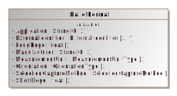

For providing details related to the concrete presentation of a ballot appropriate to the particular voting technology being used. All physical details of a ballot style are associated with a particular BallotFormat.

BallotFormat sets the [MeasurementUnit](#_19_0_4_43701b0_1644432420684_862271_5068) appropriate for the marking surface used.

Property  | Multiplicity | Type | Property Description
--------- | ------------ | ---- | ---------------------
`Application`|0..1|`String`|The application associated with the ballot format.
`ExternalIdentifier`|1..*|`ExternalIdentifier`|For associating IDs with the ballot format.
`{FiducialMark}`|0..*|`FiducialMark`|For associating a ballot format with one or more global fiducial marks appearing on a ballot.
`LongEdge`|1|`float`|Measurement of the long edge of the ballot sheet.
`Manufacturer`|0..1|`String`|Manufacturer of the ballot format.
`{mCDFArea}`|0..*|`mCDFArea`|For locating the data encoded using a mCDF Profile (e.g. mCDF Profile for Contest Selection Capture).
`MeasurementUnit`|1|`MeasurementUnitType`|The measurement units used to express locations of ballot content, such as contest option positions.
`Orientation`|1|`OrientationType`|Orientation of the page relative to the coordinate plane.
`ReadMethod`|1|`ReadMethodType`|The method used to read contest selections or indications on the ballot.
`ShortEdge`|1|`float`|Measurement of the long edge of the ballot sheet.

### *The **BallotStyle** Class*

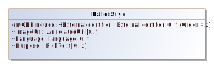

For defining a ballot style composed of ordered content (i.e. Headers or Contests) and their contest selections, and associating the ballot style with a political party, a reference to an image of the ballot, and a reference to a precinct or other geopolitical unit that the ballot is unique to. [Election](#_17_0_2_4_f71035d_1426101822599_430942_2209) includes BallotStyle.
BallotStyle references [OrderedContent](#_18_5_3_43701b0_1527684342715_643544_6146) to include content that appears on that ballot style. To preserve any rotation associated with the ballot, it is expected that the generating application will list the occurrences of [OrderedContest](#_17_0_3_43401a7_1394476416139_808596_3142) in the order as on the ballot for the associated geopolitical unit.
BallotStyle references one or more [GpUnit](#_17_0_2_4_78e0236_1389366233346_42391_2380) instances defined for the associated precincts or split precincts. If the ballot style is associated with multiple precincts (or other geographies), multiple references to the precinct [GpUnit](#_17_0_2_4_78e0236_1389366233346_42391_2380) instances can be included.

Property  | Multiplicity | Type | Property Description
--------- | ------------ | ---- | ---------------------
`DefinitionUri`|0..1|`anyURI`|For associating a BallotStyle with the location of the ballot style. Used with mCDF BSI Profile
`ExternalIdentifier`|0..*|`ExternalIdentifier`|For associating IDs with the ballot style.
`{GpUnit}`|1..*|`GpUnit`|Unique identifier for one or more GpUnit instances. For associating specific geopolitical units with the ballot style.
`ImageUri`|0..*|`AnnotatedUri`|URI for a ballot image.
`{OrderedContent}`|0..*|`OrderedContent`|For associating a ballot style with ballot content, such as contests or headers.
`{Party}`|0..*|`Party`|Unique identifier for one or more Party instances. For associating one or more parties with the ballot style.

### *The **BoundedObject** Class*

A class representing a bounding box. The box represents in absolute coordinate space its location and size. Its location is given by x,y coordinates, size by h,w values, the side of the sheet it appears on and the sheet number of the ballot style.

Property  | Multiplicity | Type | Property Description
--------- | ------------ | ---- | ---------------------
`H`|0..1|`float`|Height in ballot format measurement units.
`Sheet`|0..1|`Integer`|The ballot sheet the bounded object appears. Sheets start at 1 and increase monotonically.
`Side`|0..1|`BallotSideType`|The side of the sheet of paper the bounded object appears.
`W`|0..1|`float`|Width in ballot format measurement units.
`X`|0..1|`float`|X-coordinate for locating a bounded object (top left anchor).
`Y`|0..1|`float`|Y-coordinate for locating a bounded object (top left anchor).

### *The **Candidate** Class*

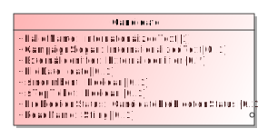

For defining information about a candidate in a contest. [CandidateSelection](#_17_0_2_4_d420315_1392145640524_831493_2562) references Candidate instances to associate one or more candidates with a contest selection. [Election](#_17_0_2_4_f71035d_1426101822599_430942_2209) includes Candidate.

Candidate uses the [Party](#_17_0_2_4_78e0236_1389366597377_433664_2698) association to reference the candidate’s political party. If the candidate is endorsed by other parties for a particular contest, the endorsing parties are referenced using the [CandidateSelection](#_17_0_2_4_d420315_1392145640524_831493_2562) attribute.

[ExternalIdentifier](#_17_0_2_4_f71035d_1430405890311_465205_2454) can be used to associate IDs with the candidate. If the type is not listed in enumeration [IdentifierType](#_17_0_2_4_f71035d_1425061188508_163854_2613), use other and include the type (that is not listed in the enumeration) in [OtherType](#_17_0_2_4_f71035d_1430405732252_109247_2429).

Property  | Multiplicity | Type | Property Description
--------- | ------------ | ---- | ---------------------
`BallotName`|1|`InternationalizedText`|For the candidate’s name as listed on the ballot.
`CampaignSlogan`|0..1|`InternationalizedText`|The slogan or motto used by the candidate in their campaign.
`{ContactInformation}`|0..1|`ContactInformation`|For associating contact information for the candidate.
`ExternalIdentifier`|0..*|`ExternalIdentifier`|For associating codes with the candidate.
`FileDate`|0..1|`date`|Date when the candidate filed for the contest.
`IsIncumbent`|0..1|`Boolean`|Boolean to indicate whether the candidate is the incumbent for the office associated with the contest. Assumed to be “false” if not present.
`IsTopTicket`|0..1|`Boolean`|Boolean to indicate whether the candidate is the top of a ticket that includes multiple candidates. Assumed to be “false” if not present.
`{Party}`|0..1|`Party`|For associating a party with the candidate.
`{Person}`|0..1|`Person`|For associating more detailed information about the candidate.
`PreElectionStatus`|0..1|`CandidatePreElectionStatus`|Registration status of the candidate, e.g., filed, qualified, etc.
`ReadName`|0..1|`String`|The name spelled phonetically for reading by a screen reader.

### *The **ContactInformation** Class*

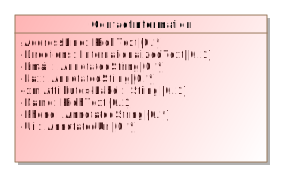

For defining contact information about objects such as persons, boards of authorities, organizations, etc. [Election](#_17_0_2_4_f71035d_1426101822599_430942_2209), [ElectionAdministration](#_18_0_2_6340208_1441311877439_710008_4433), [Person](#_17_0_5_1_43401a7_1400623980732_100904_3567), [GpUnit](#_17_0_2_4_78e0236_1389366233346_42391_2380), and [Office](#_17_0_5_1_43401a7_1400623830572_164081_3518) include ContactInformation.

To include an address for the contact, use multiple occurrences of [AddressLine](#_18_0_2_6340208_1425645912998_115448_4529). It is expected that the generating application will list the name of the person/organization in the first occurrence of [AddressLine](#_18_0_2_6340208_1425645912998_115448_4529), with subsequent ordered occurrences for street address, city, state, zip code, etc. [Directions](#_17_0_2_4_f71035d_1443105112875_46223_2290) can be used to supply any additional address-related information that may appear in multiple languages.

ContactInformation includes [LatLng](#_17_0_2_4_f71035d_1443104838926_393729_2222) so as to associate latitude/longitude with the contact address.

[Email](#_17_0_5_1_43401a7_1400668036651_743620_3650), [Fax](#_17_0_5_1_43401a7_1400668021448_721992_3646), and [Phone](#_17_0_5_1_43401a7_1400667951215_637516_3638) are of type [AnnotatedString](#_18_0_2_6340208_1497553224568_429892_4565), which permits up to a 32-character annotation to be associated with the data.

Property  | Multiplicity | Type | Property Description
--------- | ------------ | ---- | ---------------------
`AddressLine`|0..*|`RichText`|For associating an address with the contact.
`Directions`|0..1|`InternationalizedText`|Directional information in addition to address information.
`Email`|0..*|`AnnotatedString`|Email address associated with the contact.
`Fax`|0..*|`AnnotatedString`|Fax number associated with the contact.
`Label`|0..1|`String`|For use as needed and compatibility with the VIP schema.
`{LatLng}`|0..1|`LatLng`|For latitude and longitude information associated with the contact.
`Name`|0..1|`RichText`|Name associated with the contact.
`Phone`|0..*|`AnnotatedString`|Phone number associated with the contact.
`{Schedule}`|0..*|`Schedule`|For associating a schedule with the contact.
`Uri`|0..*|`AnnotatedUri`|URI associated with the contact.

### *The **Contest** Class*

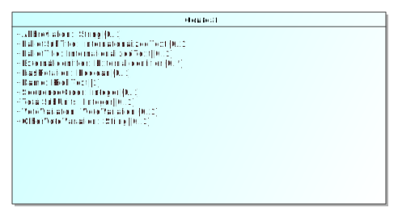

For defining a contest and linking the contest to the associated candidates, ballot measures, parties, or controlled contests. [Election](#_17_0_2_4_f71035d_1426101822599_430942_2209) includes Contest.

Contest is an abstract class with four subclasses that get used according to the type of contest:

 *  [BallotMeasureContest](#_17_0_2_4_78e0236_1389366932057_929676_2783), used for a contest involving a ballot measure
 *  [CandidateContest](#_17_0_2_4_78e0236_1389366970084_183781_2806), used for a contest involving one or more candidates for an office
 *  [ControllingContest](#_19_0_4_43701b0_1657539979421_509884_5407), an abstract class used for a contest that affects contests under its control.
 *  [RetentionContest](#_18_0_2_6340208_1425646217522_163181_4554), used for a judicial or other type of retention contest 

Contest includes [ContestSelection](#_17_0_2_4_78e0236_1389372124445_11077_2906) to link the selections on the ballot to the contest, e.g., to link one or more candidates to a candidate contest. Like Contest, [ContestSelection](#_17_0_2_4_78e0236_1389372124445_11077_2906) is also an abstract class and has subclasses that correspond to those of Contest, as follows: 

 *  [BallotMeasureContest](#_17_0_2_4_78e0236_1389366932057_929676_2783) includes [BallotMeasureSelection](#_17_0_2_4_78e0236_1389372163799_981952_2926)
 *  [CandidateContest](#_17_0_2_4_78e0236_1389366970084_183781_2806) includes [CandidateSelection](#_17_0_2_4_d420315_1392145640524_831493_2562)
 *  The subtypes of [ControllingContest](#_19_0_4_43701b0_1657539979421_509884_5407) include either [ActivationSelection](#_19_0_4_43701b0_1657540726121_302449_5703) or [PartySelection](#_17_0_2_4_f71035d_1426519980658_594892_2511)
 *  [PartyContest](#_17_0_2_4_d420315_1393514218965_55008_3144) includes [PartySelection](#_17_0_2_4_f71035d_1426519980658_594892_2511)
 *  [RetentionContest](#_18_0_2_6340208_1425646217522_163181_4554) includes [BallotMeasureSelection](#_17_0_2_4_78e0236_1389372163799_981952_2926)

\`[Contest](#_17_0_2_4_78e0236_1389366251994_876831_2400) includes a required [ElectionDistrict](#_17_0_2_4_78e0236_1389366667508_703141_2753) reference to a [GpUnit](#_17_0_2_4_78e0236_1389366233346_42391_2380) defined for the geographical scope of the contest. For example, in a state senate contest, [ElectionDistrict](#_17_0_2_4_78e0236_1389366667508_703141_2753) would reference a [GpUnit](#_17_0_2_4_78e0236_1389366233346_42391_2380) of type [ReportingUnit](#_17_0_2_4_f71035d_1400606476166_735297_2593) element defined for the district associated with the contest. [Office](#_17_0_5_1_43401a7_1400623830572_164081_3518) also includes an optional reference that serves the same purpose. Note that for contests that are state-wide or county-wide and so forth, the same [GpUnit](#_17_0_2_4_78e0236_1389366233346_42391_2380) defined for the state or county, etc., can be re-used.
[SequenceOrder](#_17_0_2_4_f71035d_1426083547931_912709_2690) is used for results display ordering, i.e., to display contests according to a particular ordering. For example, “100” may indicate a U.S. Senatorial contest, “200” may indicate a U.S. Congressional contest, etc. [SequenceOrder](#_17_0_2_4_f71035d_1426083547931_912709_2690) is not appropriate to use as the contest order on the ballot; contest order on each ballot can be preserved, however, using the [BallotStyle](#_17_0_2_4_78e0236_1389366224561_797289_2360) element, which associates ballot styles with their corresponding precincts or other geopolitical units.
When including [ExternalIdentifiers](#_17_0_2_4_f71035d_1430405712653_451634_2410), if the type is not listed in enumeration [IdentifierType](#_17_0_2_4_f71035d_1425061188508_163854_2613), use other and include the type (that is not listed in the enumeration) in [OtherType](#_17_0_2_4_f71035d_1430405732252_109247_2429).

Property  | Multiplicity | Type | Property Description
--------- | ------------ | ---- | ---------------------
`Abbreviation`|0..1|`String`|Abbreviation for the contest.
`BallotSubTitle`|0..1|`InternationalizedText`|Subtitle of the contest as it appears on the ballot.
`BallotTitle`|0..1|`InternationalizedText`|Title of the contest as it appears on the ballot.
`{ContestSelection}`|0..*|`ContestSelection`|For associating a contest selection for the contest, i.e., a candidate, a ballot measure.
`{ElectionDistrict}`|1|`ReportingUnit`|Link to a [GpUnit](#_17_0_2_4_78e0236_1389366233346_42391_2380) instance. For associating the contest with a reporting unit that represents the geographical scope of the contest, e.g., a district, etc.
`ExternalIdentifier`|0..*|`ExternalIdentifier`|For associating an ID with the contest.
`HasRotation`|0..1|`Boolean`|Boolean to indicate whether the selections in the contest are rotated. Assumed to be “no” if not present.
`Name`|1|`RichText`|Name of the contest, not necessarily as it appears on the ballot.
`SequenceOrder`|0..1|`Integer`|Orderering for listing the contest for purposes of display. If not present, no order is assumed.
`SubUnitsReported`|0..1|`Integer`|Number of subunits, e.g., precincts, that have completed reporting votes for this contest.
`TotalSubUnits`|0..1|`Integer`|Total number of subunits, e.g., precincts that have this contest on the ballot.
`VoteVariation`|0..1|`VoteVariation`|Vote variation associated with the contest, e.g., n-of-m.
`OtherVoteVariation`|0..1|`String`|For use when [VoteVariation](#_17_0_2_4_78e0236_1389798198604_276106_4268) is other.

### *The **ContestSelection** Class*

Used for the contest selections in a contest (e.g., for candidates, for ballot measures). [Contest](#_17_0_2_4_78e0236_1389366251994_876831_2400) includes [ContestSelection](#_17_0_2_4_78e0236_1389372124445_11077_2906).

[ContestSelection](#_17_0_2_4_78e0236_1389372124445_11077_2906) is an abstract class with four subclasses that get used according to the type of contest:

 *  [ActivationSelection](#_19_0_4_43701b0_1657540726121_302449_5703), used if the contest type is for an activation contest
 *  [BallotMeasureSelection](#_17_0_2_4_78e0236_1389372163799_981952_2926), used if the contest type is for a ballot measure, including for retentions
 *  [CandidateSelection](#_17_0_2_4_d420315_1392145640524_831493_2562), used if the contest type is for one or more candidates, to link the contest selection to the candidate instances and endorsement parties; and
 *  [PartySelection](#_17_0_2_4_f71035d_1426519980658_594892_2511), used if the contest type is for a party, e.g., for a party list contest.

[SequenceOrder](#_17_0_2_4_f71035d_1426296042287_22607_2200) is included to specify an ordering for the contest selections for purposes of display only. The original ballot ordering can be preserved, however, by using the [BallotStyle](#_17_0_2_4_78e0236_1389366224561_797289_2360) class.

Property  | Multiplicity | Type | Property Description
--------- | ------------ | ---- | ---------------------
`SequenceOrder`|0..1|`Integer`|Order in which the candidate is listed on the ballot for purposes of display. If not present, no order is assumed.

### *The **Election** Class*

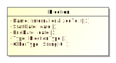

For defining details of the election and associated information such as candidates and contests.

Election includes links to the major instances that are specific to an election: [BallotStyle](#_17_0_2_4_78e0236_1389366224561_797289_2360), [Candidate](#_17_0_2_4_78e0236_1389366272694_544359_2440), and [Contest](#_17_0_2_4_78e0236_1389366251994_876831_2400).

Election includes a required reference to [ElectionScope](#_17_0_2_4_f71035d_1426102211616_609900_2331), which links to a [GpUnit](#_17_0_2_4_78e0236_1389366233346_42391_2380) instance for the purpose of identifying the geographical scope of the election. For example, for an election within a county, [ElectionScope](#_17_0_2_4_f71035d_1426102211616_609900_2331) would reference a [GpUnit](#_17_0_2_4_78e0236_1389366233346_42391_2380) defined for the county. If it is desired to include election authority information, the [GpUnit](#_17_0_2_4_78e0236_1389366233346_42391_2380) can include [ElectionAdministration](#_18_0_2_6340208_1441311877439_710008_4433).

Property  | Multiplicity | Type | Property Description
--------- | ------------ | ---- | ---------------------
`{BallotStyle}`|0..*|`BallotStyle`|For defining ballot styles associated with the election.
`{Candidate}`|0..*|`Candidate`|For defining candidates associated with the election.
`{ContactInformation}`|0..1|`ContactInformation`|For associating various contact information with the election.
`{Contest}`|0..*|`Contest`|For defining contests associated with the election.
`{ElectionScope}`|1|`ReportingUnit`|Unique identifier for a [GpUnit](#_17_0_2_4_78e0236_1389366233346_42391_2380) element. For associating the election with a reporting unit that represents the geographical scope of the election, e.g., a state, a county, etc.
`ExternalIdentifier`|0..*|`ExternalIdentifier`|For associating IDs with the election.
`Name`|1|`InternationalizedText`|For including a name for the election; the name could be the same name as appears on the ballot.
`StartDate`|1|`date`|Calendar start date of the election, e.g., “2018-11-04”.
`EndDate`|1|`date`|Calendar end date of the election; for a typical one-day election, the end date is the same as the start date.
`Type`|1|`ElectionType`|Enumerated type of election, e.g., partisan-primary, open-primary, etc.
`OtherType`|0..1|`String`|Used when [Type](#_17_0_2_4_f71035d_1426101886743_683410_2236) is other.

### *The **ElectionAdministration** Class*

Used to provide various information about an election authority. [ReportingUnit](#_17_0_2_4_f71035d_1400606476166_735297_2593) includes ElectionAdministration.

ElectionAdministration includes [ContactInformation](#_17_0_5_1_43401a7_1400624327407_326048_3637) for the election authority and, using [ElectionOfficialPerson](#_18_0_2_6340208_1441312523523_377380_4513) references one or more [Person](#_17_0_5_1_43401a7_1400623980732_100904_3567) instances defined for individuals/organizations associated with the election authority.

Property  | Multiplicity | Type | Property Description
--------- | ------------ | ---- | ---------------------
`{ContactInformation}`|0..1|`ContactInformation`|For including various contact information.
`{ElectionOfficialPerson}`|0..*|`Person`|Unique identifier for one or more Person instances defined for the election authority.
`Name`|0..1|`RichText`|Name of the election authority.

### *The **ExternalIdentifier** Class*

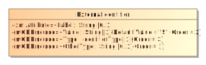

For associating a jurisdiction’s codes, i.e., identifiers, with objects such as candidates, offices, or geopolitical units such as counties, towns, precincts, etc. Multiple occurrences of ExternalIdentifier can be used to associate multiple codes, e.g., if there is a desire to associate multiple codes with a particular object such as FIPS (Federal Information Processing Standard) codes as well as OCD-IDs (Open Civic Data Identifiers).

For elements that link to ExternalIdentifier instances, if the type is not listed in enumeration [IdentifierType](#_17_0_2_4_f71035d_1425061188508_163854_2613), use other and include the type (that is not listed in the enumeration) in [OtherType](#_17_0_2_4_f71035d_1430405732252_109247_2429).

Property  | Multiplicity | Type | Property Description
--------- | ------------ | ---- | ---------------------
`Label`|0..1|`String`|For use as needed and compatibility with the VIP schema.
`Type`|1|`IdentifierType`|An identifier type, e.g., FIPS.
`OtherType`|0..1|`String`|Used when [IdentifierType](#_17_0_2_4_f71035d_1430405763078_743585_2433) value is other.
`Value`|1|`String`|The identifier used by the jurisdiction.

### *The **Geometry** Class*

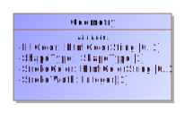

For defining a geometric shape. Geometry can be used to represent content on a physical ballot style, such as for associating an [OptionPosition](#_19_0_4_43701b0_1638813504990_545136_4990) to its shape. It is also used by [FiducialMark](#_19_0_4_43701b0_1658343993325_108021_5129) to define the shape it takes..

 

Strokes when applied, are applied evenhanded.

Property  | Multiplicity | Type | Property Description
--------- | ------------ | ---- | ---------------------
`FillColor`|0..1|`HtmlColorString`|For fiducial marks only. If not specified, no fill is assumed.
`ShapeType`|1|`ShapeType`|The shape this Geometry represents.
`StrokeColor`|0..1|`HtmlColorString`|The color of the stroke. If no color is specified, assume black (what XFA does)
`StrokeWidth`|0..1|`float`|The width of the stroke in the measurement units of the [BallotFormat](#_19_0_4_43701b0_1638813504993_325485_4993) associated with the [PhysicalContest](#_19_0_4_43701b0_1654799451085_749033_5240).

### *The **GpUnit** Class*

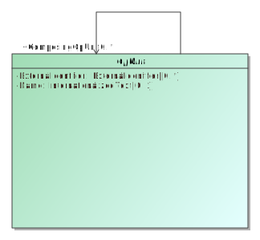

Class for describing a geo-politically bounded area of geography such as a city, district, or jurisdiction, or a precinct or split-precinct.

Reporting units can link to each other to form a hierarchicallly-oriented model of a state's (or a county's, etc.) jurisdictions, districts, and precincts.

[GpUnit](#_17_0_2_4_78e0236_1389366233346_42391_2380) is an abstract class with one subclass:

 *  [ReportingUnit](#_17_0_2_4_f71035d_1400606476166_735297_2593), for associating vote counts with geopolitical units such as cities, districts, counties, precincts, etc.

[Election](#_17_0_2_4_f71035d_1426101822599_430942_2209) and [Contest](#_17_0_2_4_78e0236_1389366251994_876831_2400) contain a required reference to [GpUnit](#_17_0_2_4_78e0236_1389366233346_42391_2380) representing the jurisdiction of the election or contest respectively; [Office](#_17_0_5_1_43401a7_1400623830572_164081_3518) contains a similar reference that is optional. [BallotStyle](#_17_0_2_4_78e0236_1389366224561_797289_2360) references [GpUnit](#_17_0_2_4_78e0236_1389366233346_42391_2380) to link a ballot style to its corresponding geopolitical unit.

Property  | Multiplicity | Type | Property Description
--------- | ------------ | ---- | ---------------------
`{ComposingGpUnit}`|0..*|`GpUnit`|Unique identifier for one or more GpUnit instances. For creating a reference to another GpUnit that is contained with the parent GpUnit.
`ExternalIdentifier`|0..*|`ExternalIdentifier`|For associating an ID with the GpUnit, e.g., a district’s or county’s code.
`Name`|0..1|`InternationalizedText`|Name of the geopolitical unit.

### *The **Header** Class*

For defining a reusable set of headers.

Property  | Multiplicity | Type | Property Description
--------- | ------------ | ---- | ---------------------
`ExternalIdentifier`|0..*|`ExternalIdentifier`|For associating an ID with the header.
`HeaderedContent`|0..1|`InternationalizedText`|For textual content appearing under a header (e.g. ballot instructions).
`Name`|1|`InternationalizedText`|Name of the header, as it is to appear on a ballot style.

### *The **Hours** Class*

Hours is used to specify a specific day and hours on that day, including the time zone. Multiple occurrences of Hours can be used if the schedule includes a range of days and hours.

Property  | Multiplicity | Type | Property Description
--------- | ------------ | ---- | ---------------------
`Day`|0..1|`DayType`|Day of the week.
`Label`|0..1|`String`|For use as needed and compatibility with the VIP schema.
`StartTime`|1|`TimeWithZone`|Start time of the schedule.
`EndTime`|1|`TimeWithZone`|End time of the schedule.

### *The **InternationalizedText** Class*

For strings that can contain multi-national text, for use with text as shown on a ballot containing multi-national text. The label attribute can be used to assign an identifier to the text as desired.

[Text](#_17_0_2_4_f71035d_1428953680100_198341_2225) uses the xsd:language type such that its language attribute must be set to a value that identifies the language.

Values for language are from ISO 639 \[12\] and include:

 *  en – English
 *  en-US – U.S. English
 *  en-GB – U.K. English
 *  fr – French
 *  es – Spanish
 *  zh – Chinese
 *  ja – Japanese
 *  ko – Korean

Property  | Multiplicity | Type | Property Description
--------- | ------------ | ---- | ---------------------
`Label`|0..1|`String`|For use as needed and compatibility with the VIP schema.
`{Text}`|1..*|`LanguageString`|Used to hold a string of text with an associated table indicating the language used.

### *The **LanguageString** Class*

Used to hold a string of text with an associated table indicating the language used.

Property  | Multiplicity | Type | Property Description
--------- | ------------ | ---- | ---------------------
`Content`|1|`String`|The string in the specified language.
`Language`|1|`language`|Identification of the language, such as 'es'.

### *The **LatLng** Class*

Associates latitude/longitude with a contact address.

Property  | Multiplicity | Type | Property Description
--------- | ------------ | ---- | ---------------------
`Label`|0..1|`String`|For use as needed and compatibility with the VIP schema.
`Latitude`|1|`double`|Latitude of the contact location.
`Longitude`|1|`double`|Longitude of the contact location.
`Source`|0..1|`String`|System used to perform the lookup from location name to lat/lng, e.g., the name of a geocoding service.

### *The **Office** Class*

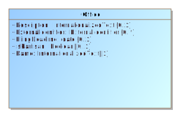

For defining an office and information associated with a contest and/or a district. [ElectionReport](#_17_0_2_4_78e0236_1389366195564_913164_2300) includes Office. [CandidateContest](#_17_0_2_4_78e0236_1389366970084_183781_2806) and [RetentionContest](#_18_0_2_6340208_1425646217522_163181_4554) reference Office.

Office includes [Term](#_17_0_2_4_f71035d_1428489072598_282236_2217) for defining details about the term of an office such as start/end dates and the type of term. [OfficeGroup](#_17_0_2_4_f71035d_1433183615993_866714_2239) is included from [ElectionReport](#_17_0_2_4_78e0236_1389366195564_913164_2300) to assign a name to a grouping of office definitions.

Office includes an optional [ElectionDistrict](#_17_0_5_1_43401a7_1400701616170_933421_3684) reference to a [GpUnit](#_17_0_2_4_78e0236_1389366233346_42391_2380) for the purpose of identifying the geographical scope of the office. For example, for an office for a state senate seat, [ElectionDistrict](#_17_0_5_1_43401a7_1400701616170_933421_3684) would include a reference to the [GpUnit](#_17_0_2_4_78e0236_1389366233346_42391_2380) defined for the district associated with that office.

Property  | Multiplicity | Type | Property Description
--------- | ------------ | ---- | ---------------------
`{ContactInformation}`|0..1|`ContactInformation`|For associating various contact information with the office.
`Description`|0..1|`InternationalizedText`|A description of the office, possibly as shown on the ballot to the voter.
`{ElectionDistrict}`|0..1|`ReportingUnit`|Link to a [GpUnit](#_17_0_2_4_78e0236_1389366233346_42391_2380) instance. For associating the office with a reporting unit that represents the geographical scope of the contest, e.g., a district, etc.
`ExternalIdentifier`|0..*|`ExternalIdentifier`|For associating IDs with the office.
`FilingDeadline`|0..1|`date`|Date and time when a candidate must have filed for the contest for the office.
`IsPartisan`|0..1|`Boolean`|Boolean to indicate whether the office is partisan, e.g., true or false. If not present, assumption is true.
`Name`|1|`InternationalizedText`|Name of the office; can appear on the ballot.
`{OfficeHolderPerson}`|0..*|`Person`|Links to one or more [Person](#_17_0_5_1_43401a7_1400623980732_100904_3567) instances defined for the office holder.
`{Term}`|0..1|`Term`|For including office term-related information.

### *The **OfficeGroup** Class*

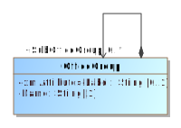

Used to assign a name to a grouping of office definitions. It includes references to [Office](#_17_0_5_1_43401a7_1400623830572_164081_3518) instances and a name to identify the grouping of references, e.g., “Judicial” or “Statewide”, etc. SubOfficeGroup can be used to create a nested hierarchy of groupings. [ElectionReport](#_17_0_2_4_78e0236_1389366195564_913164_2300) includes OfficeGroup.

Property  | Multiplicity | Type | Property Description
--------- | ------------ | ---- | ---------------------
`Label`|0..1|`String`|For use as needed and compatibility with the VIP schema.
`Name`|1|`String`|Name of the office grouping.
`{Office}`|0..*|`Office`|Link to one or more [Office](#_17_0_5_1_43401a7_1400623830572_164081_3518) instances.
`{SubOfficeGroup}`|0..*|`OfficeGroup`|For defining a nested hierarchy of [Office](#_17_0_5_1_43401a7_1400623830572_164081_3518) instance groupings.

### *The **OrderedContent** Class*

An abstract base class for content that can appear under a particular ballot style.

OrderedContent is an abstract class with two subclasses that get used according to the type of content:

 *  OrderedContest, used for the appearance of a contest.
 *  OrderedHeader, used for the appearance of a header, optionally with the inclusion of contests.

### *The **Party** Class*

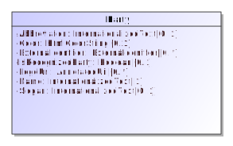

Used to describe a political party that can then be referenced in other elements. [ElectionReport](#_17_0_2_4_78e0236_1389366195564_913164_2300) includes Party. [Candidate](#_17_0_2_4_78e0236_1389366272694_544359_2440), [PartyContest](#_17_0_2_4_d420315_1393514218965_55008_3144), [PartyRegistration](#_17_0_2_4_78e0236_1394566839296_58362_2826), and [Person](#_17_0_5_1_43401a7_1400623980732_100904_3567) reference Party.

Party is an abstract type with one subtype [Coalition](#_18_0_2_6340208_1425647247631_162984_4712), used to define coalitions.

The Color attribute specifies a 6-digit RGB code displayable using HTML.

Property  | Multiplicity | Type | Property Description
--------- | ------------ | ---- | ---------------------
`Abbreviation`|0..1|`InternationalizedText`|Short name for the party, e.g., “DEM”.
`Color`|0..1|`HtmlColorString`|For associating an HTML RGB color coding with the party.
`{ContactInformation}`|0..1|`ContactInformation`|For associating contact information regarding the party, e.g., party offices.
`ExternalIdentifier`|0..*|`ExternalIdentifier`|For associating IDs with the party.
`IsRecognizedParty`|0..1|`Boolean`|For indicating whether the party is recognized by the election authority; “false” is assumed if not present.
`{LeaderPerson}`|0..*|`Person`|Identification of a Party's leader.
`LogoUri`|0..*|`AnnotatedUri`|A URI to the party’s graphical logo.
`Name`|1|`InternationalizedText`|Official full name of the party, e.g., “Republican”; can appear on the ballot.
`{PartyScopeGpUnit}`|0..*|`GpUnit`|The GpUnit(s) the party operates in or the top-most GpUnit.
`Slogan`|0..1|`InternationalizedText`|The slogan or motto used by a political party.

### *The **PartyRegistration** Class*

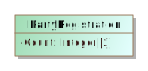

For tracking the number of registered voters per party per geopolitical unit, i.e., for reporting on the number of registered voters of a particular party in a district or other type of reporting unit. Referenced by [GpUnit](#_17_0_2_4_78e0236_1389366233346_42391_2380).

Property  | Multiplicity | Type | Property Description
--------- | ------------ | ---- | ---------------------
`Count`|1|`Integer`|A count for tracking the number of registered voters.
`{Party}`|1|`Party`|Link to a [Party](#_17_0_2_4_78e0236_1389366278128_412819_2460) instance. For associating a political party.

### *The **Person** Class*

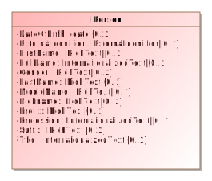

For defining information about a person; the person may be a candidate, election official, authority for a reporting unit, etc. [ElectionReport](#_17_0_2_4_78e0236_1389366195564_913164_2300) includes Person. [Candidate](#_17_0_2_4_78e0236_1389366272694_544359_2440), [ElectionAdministration](#_18_0_2_6340208_1441311877439_710008_4433) and
[GpUnit](#_17_0_2_4_78e0236_1389366233346_42391_2380) references Person. Person optionally references [ContactInformation](#_17_0_5_1_43401a7_1400624327407_326048_3637) for associating contact information.

Multiple occurrences of the MiddleName attribute can be used as needed, e.g., for names such as “John Andrew Winston Smith”.

Property  | Multiplicity | Type | Property Description
--------- | ------------ | ---- | ---------------------
`{ContactInformation}`|0..*|`ContactInformation`|For associating contact information with the person.
`DateOfBirth`|0..1|`date`|Person’s date of birth.
`ExternalIdentifier`|0..*|`ExternalIdentifier`|For associating codes with the person.
`FirstName`|0..1|`RichText`|Person’s first (given) name.
`FullName`|0..1|`InternationalizedText`|Person’s full name.
`Gender`|0..1|`RichText`|Person’s gender.
`LastName`|0..1|`RichText`|Person’s last (family) name.
`MiddleName`|0..*|`RichText`|Person’s middle name.
`Nickname`|0..1|`RichText`|Nickname associated with the person.
`{Party}`|0..1|`Party`|Links to a [Party](#_17_0_2_4_78e0236_1389366278128_412819_2460) instance. For associating a political party with the person.
`Prefix`|0..1|`RichText`|A prefix associated with the person, e.g., Mr.
`Profession`|0..1|`InternationalizedText`|Person’s profession.
`Suffix`|0..1|`RichText`|A suffix associated with the person, e.g., Jr.
`Title`|0..1|`InternationalizedText`|A title associated with the person.

### *The **PhysicalContest** Class*

For the appearance of a contest on a particular ballot style with physical details such as the locations and shapes of contest option positions.

Property  | Multiplicity | Type | Property Description
--------- | ------------ | ---- | ---------------------
`{BallotFormat}`|1|`BallotFormat`|For associating a ballot format with a physical contest.
`{Extent}`|0..*|`BoundedObject`|The extent of the contest. If the contest spans multiple sections of the ballot (e.g. columns or pages), then multiple extents may be provided.
`{FiducialMark}`|0..*|`FiducialMark`|For associating a ordered physical contest with one or more local fiducial marks appearing near the contest.
`{PhysicalContestOption}`|0..*|`PhysicalContestOption`|The contest options associated with the contest, including physical details.

### *The **PhysicalContestOption** Class*

For associating a [ContestSelection](#_17_0_2_4_78e0236_1389372124445_11077_2906) to its physical manifestation. Each PhysicalContestOption is specified in terms of a particular [BallotFormat](#_19_0_4_43701b0_1638813504993_325485_4993). A PhysicalContestOption may have multiple [OptionPosition](#_19_0_4_43701b0_1638813504990_545136_4990) instances, for voting methods that require it (e.g. rank choice voting). [WriteInPosition](#_19_0_4_43701b0_1638813504998_266381_4995) specifies the response area where name(s) may written-in.

Property  | Multiplicity | Type | Property Description
--------- | ------------ | ---- | ---------------------
`{ContestSelection}`|0..1|`ContestSelection`|For associating a PhysicalContestOption with a ContestSelection. This should always be provided unless the contest option is for a write-in.
`{OptionPosition}`|1..*|`OptionPosition`|
`{WriteInPosition}`|0..*|`WriteInPosition`|

### *The **Schedule** Class*

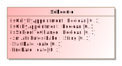

For defining a schedule associated with a particular election office or location. [ContactInformation](#_17_0_5_1_43401a7_1400624327407_326048_3637) includes Schedule.

Property  | Multiplicity | Type | Property Description
--------- | ------------ | ---- | ---------------------
`{Hours}`|0..*|`Hours`|For specifying a range of hours for a schedule.
`IsOnlyByAppointment`|0..1|`Boolean`|If an appointment is only by appointment; assumed to be “no” if not present.
`IsOrByAppointment`|0..1|`Boolean`|If an appointment can by appointment presumably as desired; assumed to be “no” if not present.
`IsSubjectToChange`|0..1|`Boolean`|If an appointment may be subject to change; assumed to be “no” if not present.
`Label`|0..1|`String`|For use as needed and compatibility with the VIP schema.
`StartDate`|0..1|`date`|For the starting date of the schedule.
`EndDate`|0..1|`date`|For the ending date of the schedule.

### *The **SpatialDimension** Class*

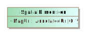

For defining the spatial layout of a [GpUnit](#_17_0_2_4_78e0236_1389366233346_42391_2380), e.g., a map or a spatial extent (a polygon that shows the related area) for various purposes, including to visualize election results, to understand the composition of districts, or to determine whether [GpUnit](#_17_0_2_4_78e0236_1389366233346_42391_2380) instances are properly related. [GpUnit](#_17_0_2_4_78e0236_1389366233346_42391_2380) includes SpatialDimension.

Property  | Multiplicity | Type | Property Description
--------- | ------------ | ---- | ---------------------
`MapUri`|0..*|`AnnotatedUri`|Typically a URI to a map of the [GpUnit](#_17_0_2_4_78e0236_1389366233346_42391_2380).
`{SpatialExtent}`|0..1|`SpatialExtent`|For associating a [GpUnit](#_17_0_2_4_78e0236_1389366233346_42391_2380) element’s spatial extent information.

### *The **SpatialExtent** Class*

[SpatialDimension](#_17_0_2_4_f71035d_1407165065674_39189_2188) includes SpatialExtent for defining a [GpUnit](#_17_0_2_4_78e0236_1389366233346_42391_2380) instance’s spatial extent data and the format used for the spatial extent.

Property  | Multiplicity | Type | Property Description
--------- | ------------ | ---- | ---------------------
`Coordinates`|1|`RichText`|The data coordinates constituting the spatial extent.
`Format`|1|`GeoSpatialFormat`|Enumerated type for the format used, e.g., gml, kml, wkt, etc.

### *The **Term** Class*

For describing information about an office term. [Term](#_17_0_2_4_f71035d_1428489072598_282236_2217) is included by [Office](#_17_0_5_1_43401a7_1400623830572_164081_3518).

Property  | Multiplicity | Type | Property Description
--------- | ------------ | ---- | ---------------------
`Label`|0..1|`String`|For use as needed and compatibility with the VIP schema.
`StartDate`|0..1|`date`|Start date for the current term of the office.
`EndDate`|0..1|`date`|End date for the current term of the office.
`Type`|0..1|`OfficeTermType`|Enumerated type of term, e.g., full-term, unexpired-term, etc.

